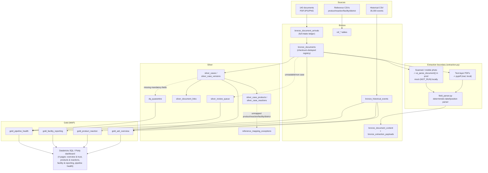

# ADR/AEFI Pharmacovigilance Document Intelligence

Databricks lakehouse pipeline that ingests mixed-format adverse drug reaction
(ADR) / adverse event following immunisation (AEFI) case documents (CIOMS
forms, manufacturer narratives, scanned forms, mobile photographs,
follow-ups, duplicates, non-case documents), classifies and extracts
structured case data, curates a versioned lakehouse model, applies data
quality/reconciliation, and publishes a governed dashboard covering both
pharmacovigilance operations and data-product monitoring.

Source assignment: `data/raw/assignment/ADR_Databricks_Candidate_Assignment.pdf`
(copied verbatim into project isolation). Full requirements, verified-source
profiling, and decisions: `REQUIREMENTS.md`. Known limitations and trade-offs:
`RISKS_AND_TRADEOFFS.md`. Current delivery status: `STATUS.md`.

## Architecture



- **Bronze**: idempotent document registry keyed by content checksum
  (`document_id = sha256(bytes)`), so exact-duplicate files never create a
  second document or a second case. Every physical arrival (including
  duplicates) is still recorded in `bronze_document_arrivals` for lineage;
  only the deduped set flows downstream. Historical events and reference
  dictionaries are batch-loaded verbatim.
- **Extraction boundary**: text-layer PDFs (CIOMS/manufacturer/non-case,
  confirmed by direct inspection — see `REQUIREMENTS.md`) are parsed with a
  real, working local `pypdf` + deterministic label/position parser
  (`field_parser.py`) — no OCR needed. Scanned PDFs and mobile photos have no
  text layer; without a real OCR/document-AI credential in this environment,
  they honestly route to the review queue rather than fabricating extracted
  fields. Production substitutes an `ai_parse_document()`-backed extractor
  behind the same `TextExtractor` interface.
- **Silver**: assembles case versions (initial + follow-ups), case-level
  product/reaction child rows (never flattened — a case with 2 products and
  2 reactions stays 1 case), document links (source-of-version,
  duplicate-of), a human review queue, reference-mapping exceptions, and
  mandatory-field quarantine.
- **Gold (WAP)**: Spark SQL only, built into `_staging` tables and only
  promoted to the published name if `silver_case_total == gold_case_total`
  reconciles — a failed reconciliation never exposes a partial Gold state.
- **Dashboard**: 4-page Plotly/Databricks SQL dashboard with a data-trust
  panel first, then case volume, products/reactions, facility/reporting, and
  pipeline health, plus a case-level drill-down (structured fields only, no
  raw narrative exposed).

## Setup and execution

```powershell
# Local development / testing (no Databricks required)
py -3.11 -m pip install -e ".[test]"
py -3.11 -m pytest tests/ -q -m local_fast
py -3.11 ../../local-platform/manage.py test --mode docker-compat `
  --project projects/10_adr_pharmacovigilance

# Databricks deployment
databricks bundle validate -t dev
databricks bundle deploy -t dev
databricks bundle run -t dev project_10_adr_pharmacovigilance_end_to_end_job
```

The Bundle job chain: `bronze_ingestion -> silver_transform -> gold_wap_publish
-> sql_validation -> pharmacovigilance_dashboard` (see
`resources/10_adr_pharmacovigilance.job.yml`). `raw_dir` is passed as
`${workspace.file_path}/data/raw` — deliberately *not*
`${workspace.file_path}/../data/raw`, since `${workspace.file_path}` already
**is** the synced Bundle `files/` root (a real bug found and fixed in project
09 of this repo; documented here so it isn't repeated).

## Assumptions

- The 140-document synthetic set and the 35,000-row historical CSV are both
  treated as static, provided sources for this MVP (brief explicitly allows
  batch ingestion; Auto Loader is the justified production pattern for a
  real incoming document stream — see `REQUIREMENTS.md` Decision 3).
- No external OCR/document-AI credential is available in this development
  environment. `ai_parse_document()` is the intended production path for the
  scanned/photo document subset (see Limitations).
- Reference dictionaries (22 products, 22 reactions, 60 facilities, 20
  districts) are treated as complete for the historical dataset (verified:
  zero orphan foreign keys) but are known to be incomplete for the
  document-pipeline's fictional/misspelled product names (see Limitations).

## Limitations

- **OCR/document-AI is mocked, not real**: ~40% of the 140 documents
  (scanned forms + mobile photos + low-quality/rescanned variants) have no
  extractable text layer and correctly route to the review queue with zero
  fabricated confidence, rather than a guessed extraction. Wiring the real
  `DatabricksAIParseService` (same `TextExtractor` interface) against a live
  Databricks SQL warehouse is the immediate next step to close this gap —
  see `jobs.py`/`extraction.py` for the swap point.
- **Reference mapping is exact-match only**: 18 of 91 extracted products in
  this document set don't match `product_dictionary.csv` by exact
  case-insensitive name/brand (e.g. `"GlargiBase"` vs. the dictionary's
  standard names) and correctly land in `reference_mapping_exceptions`
  rather than being silently accepted or dropped. Fuzzy/synonym matching
  (e.g. embeddings or `ai_query()`-based entity resolution) is a follow-up,
  not attempted here.
- **Containerized `local-platform` gate not yet run for this project**: this
  bare Windows development host has no Delta package / `winutils.exe`
  configured, so `.format("delta")`-writing component tests
  (`test_bronze.py::test_write_bronze_documents_is_idempotent_across_reruns`,
  both tests in `test_gold.py`) could not execute here — this matches
  `docs/TIMED_MVP.md`'s own stated split ("Host PySpark results are
  diagnostic only and do not satisfy the local runtime gate"). All
  pure-logic tests (field parsing, extraction classification, Silver case
  assembly — 19 tests) pass on host and were additionally validated by hand
  against the real 140-document set. Running
  `py -3.11 local-platform/manage.py test --project projects/10_adr_pharmacovigilance`
  is the next step before a real Databricks deployment.
- **Near-duplicate (different-checksum) detection is implemented but not
  exercised by this dataset**: all 7 `duplicate_*` files in the assignment
  set turned out to be byte-identical to their originals (caught at the
  Bronze checksum layer), so Silver's separate near-duplicate logic (same
  case reference, different document bytes) has no positive example in this
  specific fixture set, only unit-test coverage with synthetic input.
- **`failure` label / CI-status correlation, advanced statistics**: out of
  scope per the assignment brief (advanced statistical signal detection not
  required).

## Production next steps

1. Wire `ai_parse_document()` as the real OCR/document-AI backend for the
   scanned/photo document subset.
2. Run the containerized `local-platform` gate, then the CI-driven one-shot
   compatibility workflow, then Terraform apply + Bundle deploy + a real dev
   job run (repo-standard sequence — see `docs/TIMED_MVP.md`).
3. Fuzzy/synonym reference mapping for products/reactions.
4. PII masking pass on patient initials / reporter contact before Gold
   exposure (currently excluded from the Gold schema entirely rather than
   masked in place — confirm this is sufficient or add explicit masking).
5. Incremental/streaming document ingestion via Auto Loader against a real
   Unity Catalog volume, replacing the static-directory walk used for this
   MVP's 140-document set.
